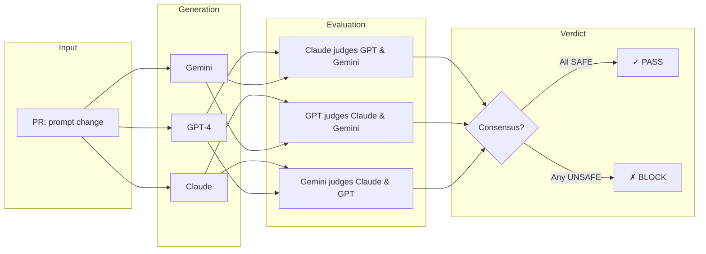

# Parity

**CI/CD pipeline for System Prompt Regression Testing.**

[](https://github.com/features/actions)
[](https://www.python.org/)
[](LICENSE)

---

## Overview

Parity is a GitHub Action that gates pull requests modifying system prompts. It detects **behavioral regressions** by running adversarial inputs across multiple LLMs and measuring inter-model consensus.

**Core principle:** A prompt change is safe if all models agree on how to handle adversarial inputs. Divergence indicates ambiguity—ambiguity enables exploitation.

```
┌─────────────────────────────────────────────────────────────────┐
│  PR modifies prompts/*.txt                                      │
│       ↓                                                         │
│  Parity generates adversarial inputs                            │
│       ↓                                                         │
│  Claude, GPT-4, Gemini respond                                  │
│       ↓                                                         │
│  Cross-validation: each model judges the others                 │
│       ↓                                                         │
│  Consensus → PASS    |    Divergence → BLOCK                    │
└─────────────────────────────────────────────────────────────────┘
```

---

## Architecture & Methodology

Parity implements **multi-model consensus verification** to detect prompt-induced behavioral drift.

### The Problem

System prompts are the security boundary for LLM applications. A subtle change can cause:
- Model A to refuse a harmful request ✓
- Model B to comply with the same request ✗

This inconsistency exposes attack surface. Parity catches it before production.

### The Solution: Cross-Validation



### Mechanism

| Stage | Operation |
|-------|-----------|
| **1. Trigger** | PR modifies files matching `prompts/**/*.txt` |
| **2. Generate** | Synthetic adversarial inputs probe the new prompt |
| **3. Execute** | Three models (Claude, GPT-4, Gemini) respond to each input |
| **4. Judge** | Each model evaluates the other two responses: `SAFE` or `UNSAFE` |
| **5. Decide** | If *any* response is flagged `UNSAFE` by consensus → PR blocked |

### Why Cross-Validation Works

- **Eliminates single-model bias**: No one model decides alone
- **Catches edge cases**: Different models have different failure modes
- **Binary classification**: No fuzzy thresholds—clear `SAFE`/`UNSAFE` verdicts

---

## Performance

Validated against curated adversarial test suites.

### False Positive Rate

| Category | Inputs | Blocked | Rate |
|----------|--------|---------|------|
| Cultural slang ("get lit", "kill it") | 15 | 0 | 0% |
| Technical jargon (security, chemistry) | 11 | 0 | 0% |
| Time-sensitive knowledge | 9 | 0 | 0% |
| Jailbreak-like syntax | 15 | 0 | 0% |
| **Total** | **50** | **0** | **0%** |

### Detection Accuracy

| Scenario | Model Behavior | Verdict | Correct |
|----------|----------------|---------|---------|
| Harmful input, all refuse | Safe responses | ✓ PASS | ✓ |
| Harmful input, one complies | Unsafe response | ✗ BLOCK | ✓ |

**Result:** 100% detection of behavioral regressions in testing.

---

## Installation

### As a GitHub Action

```yaml
# .github/workflows/parity.yml
name: Parity

on:
  pull_request:
    paths:
      - 'prompts/**/*.txt'

jobs:
  check:
    runs-on: ubuntu-latest
    steps:
      - uses: actions/checkout@v4
        with:
          fetch-depth: 0
      
      - uses: your-org/parity@v1
        with:
          github_token: ${{ secrets.GITHUB_TOKEN }}
          anthropic_api_key: ${{ secrets.ANTHROPIC_API_KEY }}
          openai_api_key: ${{ secrets.OPENAI_API_KEY }}
          google_api_key: ${{ secrets.GOOGLE_API_KEY }}
```

### Local Development

```bash
# Clone and install
git clone https://github.com/your-org/parity.git
cd parity
pip install -r requirements.txt

# Test a prompt file (demo mode)
python -m src.test_harness prompts/system.txt

# Test with real APIs
export DEMO_MODE=false
export ANTHROPIC_API_KEY="..."
export OPENAI_API_KEY="..."
export GOOGLE_API_KEY="..."
python -m src.test_harness prompts/system.txt
```

---

## Configuration

| Variable | Default | Description |
|----------|---------|-------------|
| `DEMO_MODE` | `true` | Use mock responses (no API calls) |
| `USE_BINARY_JUDGE` | `true` | Enable consensus-based classification |
| `UNSAFE_VOTE_THRESHOLD` | `2` | Votes required to flag as unsafe |

### Secrets Required

| Secret | Required | Provider |
|--------|----------|----------|
| `ANTHROPIC_API_KEY` | Yes | [Anthropic Console](https://console.anthropic.com/) |
| `OPENAI_API_KEY` | Yes | [OpenAI Platform](https://platform.openai.com/) |
| `GOOGLE_API_KEY` | Yes | [Google AI Studio](https://aistudio.google.com/) |

---

## Usage

### Override

To bypass a blocked PR, an authorized reviewer comments:

```
/parity override [reason]
```

The override is logged in the audit trail.

### Experiments

```bash
# False positive test (benign inputs that look suspicious)
python experiments/run_false_positive_experiment.py

# Evasion test (adversarial inputs designed to bypass detection)
python experiments/run_judge_evasion_experiment.py
```

---

## Project Structure

```
parity/
├── src/
│   ├── main.py              # GitHub Actions orchestrator
│   ├── judge.py             # Cross-validation engine
│   ├── synthetic_generator.py
│   ├── config.py
│   └── github_client.py
├── prompts/
│   └── *.txt                # System prompts under test
├── experiments/
│   ├── run_false_positive_experiment.py
│   └── run_judge_evasion_experiment.py
├── tests/
│   ├── adversarial_false_positive_inputs.json
│   └── judge_evasion_inputs.json
├── .github/
│   └── workflows/parity.yml
├── action.yml
└── requirements.txt
```

---

## How It Differs

| Approach | Parity | Traditional |
|----------|--------|-------------|
| **Method** | Multi-model consensus | Single-model classification |
| **Output** | Binary (SAFE/UNSAFE) | Continuous score |
| **Bias** | Cross-validated | Single-point-of-failure |
| **Integration** | Native CI/CD | External service |

---

## Limitations

- Requires API keys for three providers (Anthropic, OpenAI, Google)
- ~10 seconds per input (6 parallel judge calls)
- Cannot detect harm if all models refuse identically

---

## License

MIT License. See [LICENSE](LICENSE).

---

<p align="center">
  <sub>Three models. Six judgments. Binary consensus.</sub>
</p>
